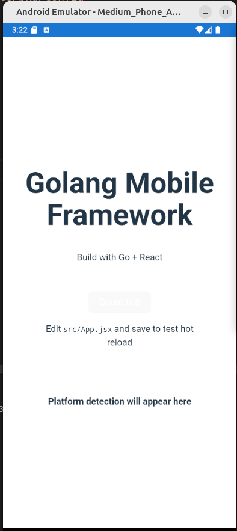

# Golang Mobile Framework

A framework for creating mobile applications using Golang with UI from React, Vue, Svelte, or Angular. This framework uses a WebView or Expo approach to wrap web applications into native Android and iOS applications.

## Features

- 🌐 **Web to App Bundle** - Package web applications into native mobile applications
- 🔄 **Hot Reload** - Development with hot reload for quick changes
- 👁️ **Preview** - Preview to simulator, emulator, or real devices
- 📱 **Cross-Platform** - Build for Android and iOS from the same codebase

## Preview



## Requirements

- Go 1.18 or newer
- Node.js and npm
- Android SDK (for Android builds)
- Xcode (for iOS builds, macOS only)
- ADB (Android Debug Bridge)
- Android Simulator (Android Studio)
- Gradle (for Android builds)
- CocoaPods (for iOS builds)
- iOS Simulator (Xcode)
- Xcode Command Line Tools
- Android Studio
- Xcode

## Project Structure

```
golang-browser-mobile/
├── frontend/                # Web project (React, Vue, etc.)
│   ├── src/                 # Frontend web source code
│   ├── App.js               # React Native application for Expo
│   ├── app.json             # Expo configuration
│   ├── index.html           # Main HTML template for web
│   └── package.json         # npm configuration
├── mobile-shell/            # Mobile wrapper
│   ├── android/             # Android shell
│   ├── ios/                 # iOS shell
│   └── assets/              # Bundled assets
├── main.go                  # Main Golang program
└── README.md                # Documentation
```

## Usage

### Development Mode with Hot Reload

```bash
# Run in WebView development mode
go run main.go -dev

# Run in development mode with preview to Android emulator/device
go run main.go -dev -preview -android [-device=DEVICE_ID]

# Run in development mode with preview to iOS simulator/device
go run main.go -dev -preview -ios [-device=DEVICE_ID]
```

### Production Build

```bash
# Build Frontend + Android (WebView)
go run main.go -android

# Build Frontend + iOS (WebView)
go run main.go -ios

# Build and run directly on device
go run main.go -android -preview [-device=DEVICE_ID]
```

## Platform Bridge

This framework provides a bridge for communication between web applications and the native platform:

### For Android

```javascript
// Call native functions from JavaScript
if (window.AndroidBridge) {
  const deviceInfo = window.AndroidBridge.getPlatformInfo();
  window.AndroidBridge.showToast("Hello from JavaScript!");
}
```

### For iOS

```javascript
// Call native functions from JavaScript
if (
  window.webkit &&
  window.webkit.messageHandlers &&
  window.webkit.messageHandlers.iOSBridge
) {
  window.webkit.messageHandlers.iOSBridge.postMessage({
    action: "getPlatformInfo",
  });

  // iOS will call the setPlatformInfo function that you define in JavaScript
}
```

## Web Framework Customization

You can replace React with Vue, Svelte, or Angular by adjusting:

1. Frontend dependencies in `package.json`
2. Build configuration
3. Build output path in the `copyBuildToMobile()` function in `main.go`

## License

MIT
